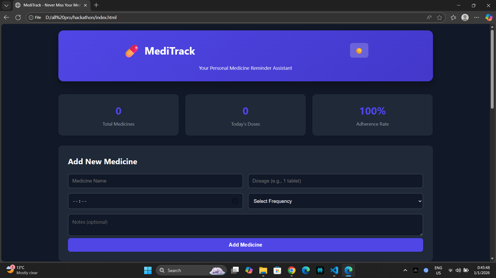
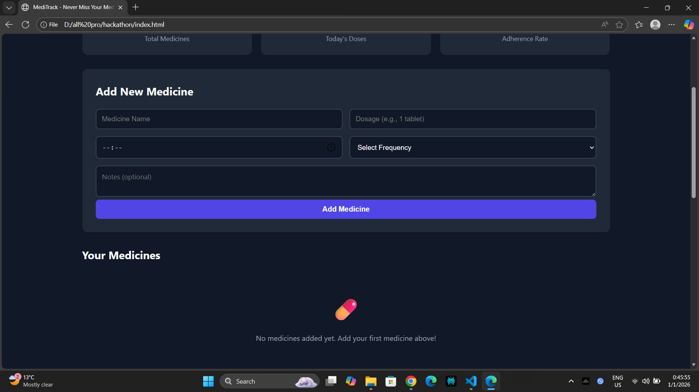
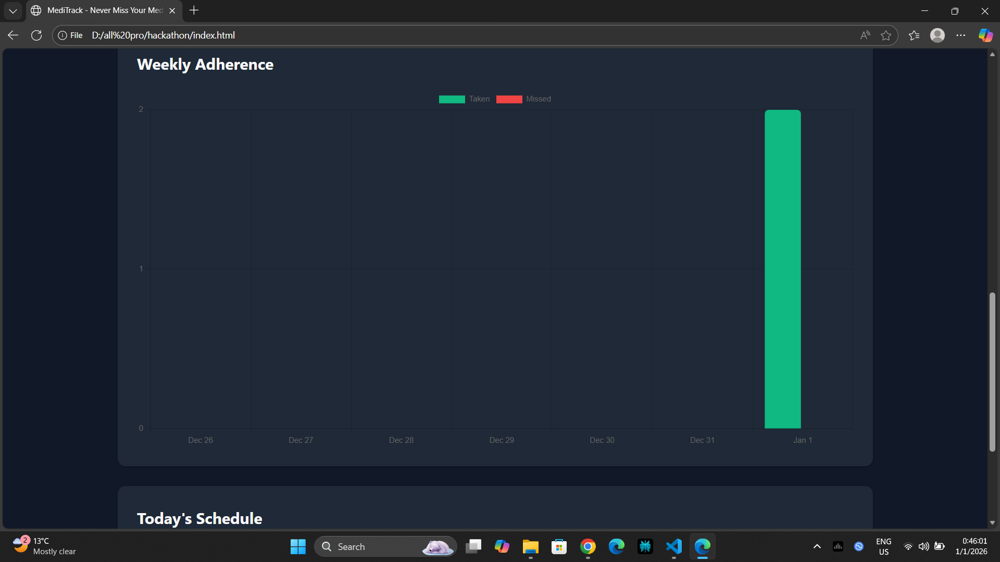

# 💊 MediTrack - Medicine Reminder & Tracker

> Never miss your medicine again! A simple, effective web application to track medications and get timely reminders.

## 🌟 Features

- ✅ **Medicine Management** - Add, edit, and delete medicines
- ⏰ **Smart Reminders** - Browser notifications at scheduled times
- 📊 **Adherence Tracking** - Visual charts showing your compliance
- 📅 **Daily Schedule** - View all medicines for the day
- 🌓 **Dark Mode** - Easy on the eyes, day or night
- 💾 **Offline Support** - Works without internet (LocalStorage)
- 📱 **Responsive Design** - Works on all devices

## 🎯 Problem Statement

**Medication Non-Adherence: A Silent Healthcare Crisis**

- 50% of elderly patients miss their medicines regularly
- ₹5000+ crore annual loss due to medication non-compliance in India
- 125,000+ deaths yearly due to missed medications

**MediTrack solves this by:**
- Sending timely reminders
- Tracking adherence patterns
- Providing visual feedback
- Empowering patients and caregivers

## 🚀 Live Demo

[View Live Demo](https://trekzest.github.io/meditrack)

## 📸 Screenshots

### Dashboard


### Add Medicine


### Adherence Chart


## 🛠️ Tech Stack

- **Frontend:** HTML5, CSS3, JavaScript (ES6+)
- **Charts:** Chart.js
- **Storage:** LocalStorage
- **Notifications:** Browser Notification API
- **Deployment:** GitHub Pages

## 📦 Installation & Setup

### Local Development

1. **Clone the repository**
```bash
git clone https://github.com/trekzest/meditrack.git
cd meditrack
```

2. **Open in browser**
```bash
# Simply open index.html in your browser
# Or use a local server
python -m http.server 8000
# Then visit http://localhost:8000
```

### GitHub Pages Deployment

1. **Push to GitHub**
```bash
git add .
git commit -m "Initial commit"
git push origin main
```

2. **Enable GitHub Pages**
   - Go to repository Settings
   - Scroll to "Pages" section
   - Select "main" branch
   - Click Save
   - Your site will be live at: `https://yourusername.github.io/meditrack`

## 📱 Usage

### Adding Medicine
1. Fill in the medicine details (name, dosage, time, frequency)
2. Add optional notes
3. Click "Add Medicine"

### Getting Reminders
1. Allow browser notifications when prompted
2. Receive alerts at scheduled times
3. Mark medicines as taken directly from notification

### Tracking Adherence
1. View weekly chart showing taken vs missed doses
2. Check adherence rate percentage
3. Review daily schedule

## 🎨 Customization

### Changing Colors
Edit `styles.css` variables:
```css
:root {
    --primary: #4f46e5;  /* Main color */
    --secondary: #10b981; /* Success color */
    --danger: #ef4444;    /* Danger color */
}
```

### Adding Features
Common additions:
- Export data as PDF
- Caregiver sharing
- Medicine interaction checker
- Voice reminders
- Multiple user profiles

## 🔧 Project Structure

```
meditrack/
├── index.html          # Main HTML file
├── styles.css          # Styling and themes
├── app.js              # Application logic
├── README.md           # Documentation
└── Image/              # Demo images 
```

## 🌐 Browser Support

- ✅ Chrome (recommended)
- ✅ Firefox
- ✅ Safari
- ✅ Edge
- ⚠️ Notification API may not work on all mobile browsers

## 📊 Data Storage

All data is stored locally in your browser using LocalStorage:
- **Privacy:** No data sent to servers
- **Persistence:** Data remains until cleared
- **Backup:** Export/import feature (can be added)

## 🤝 Contributing

Contributions are welcome! Feel free to:
- Report bugs
- Suggest features
- Submit pull requests

## 📄 License

MIT License - feel free to use for personal or commercial projects

## 👤 Author

**Your Name**
- GitHub: [@TREKZST](https://github.com/trekzest)
- LinkedIn: [trekzest](https://linkedin.com/in/trekzest)

## 🙏 Acknowledgments

- Chart.js for beautiful charts
- Icons from Unicode emojis
- Inspired by real healthcare challenges

## 📞 Support

If you found this helpful, please ⭐ star the repository!

For issues or questions, open a GitHub issue.

---

**Built with ❤️ for Hackathon Simverse Hackathon 2025

Theme: Healthcare Innovation  
Date: 1 Jan 2026 
Team: SAWRRABH